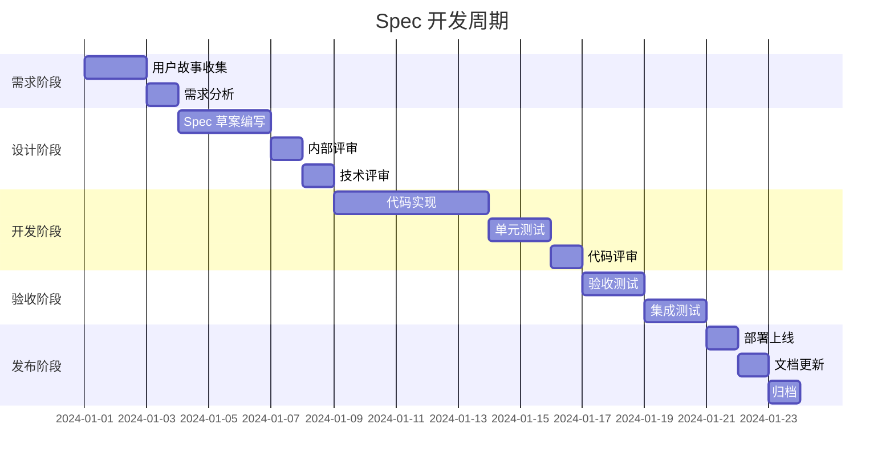
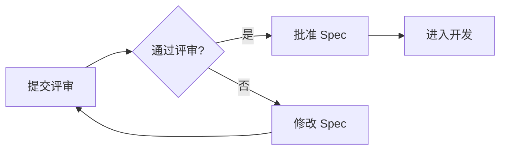
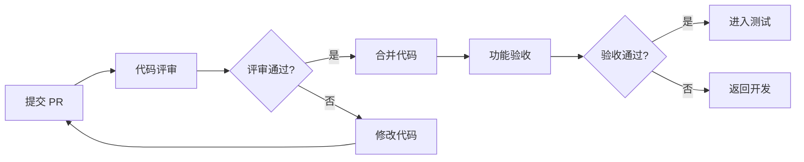
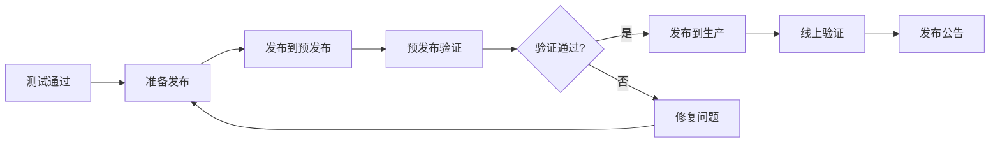

# Spec 开发流程规范

本文档详细说明了 MicroAdmin 项目的 Spec（功能规格）开发全流程，确保从需求收集到发布的每个环节都有明确的标准和规范。

---

## 目录

1. [流程概览](#流程概览)
2. [阶段详解](#阶段详解)
3. [角色职责](#角色职责)
4. [质量标准](#质量标准)
5. [工具与模板](#工具与模板)
6. [常见问题](#常见问题)

---

## 流程概览

```
需求收集 → 规格编写 → 评审确认 → 开发实现 → 验收检查 → 测试覆盖 → 发布上线 → 归档更新
   │          │          │          │          │          │          │          │
   ▼          ▼          ▼          ▼          ▼          ▼          ▼          ▼
用户故事   Spec文档   技术评审   代码实现   验收标准   测试报告   部署上线   版本更新
```

### 甘特图



---

## 阶段详解

### 1. 需求收集阶段

**目标**: 明确功能需求和用户故事

#### 1.1 用户故事编写模板

```
作为 [角色]
我想要 [功能]
以便于 [价值]

验收标准：
- [ ] 标准 1
- [ ] 标准 2
- [ ] 标准 3
```

#### 1.2 需求检查清单

- [ ] 需求描述清晰、无歧义
- [ ] 有明确的价值主张
- [ ] 验收标准可测试
- [ ] 与现有系统兼容性分析
- [ ] 性能和安全要求明确

#### 1.3 产出物

- 用户故事文档
- 需求分析报告
- 初步可行性评估

---

### 2. 规格编写阶段

**目标**: 编写完整的技术规格文档

#### 2.1 Spec 文档结构

```markdown
# Spec: [功能名称]

## 元信息
- **Spec ID**: FEAT-001
- **创建日期**: 2024-01-01
- **负责人**: @username
- **优先级**: P0 (P0/P1/P2/P3)
- **状态**: Draft (Draft/Review/Approved/InProgress/Testing/Done)

## 背景与目标
### 业务背景
### 技术目标
### 成功指标

## 功能需求
### 2.1 功能清单
### 2.2 用户故事
### 2.3 验收标准

## 技术方案
### 3.1 技术选型
### 3.2 架构设计
### 3.3 接口定义
### 3.4 数据模型

## 实施计划
### 4.1 任务分解
### 4.2 里程碑
### 4.3 依赖关系

## 风险评估
### 5.1 技术风险
### 5.2 进度风险
### 5.3 应对措施

## 参考资料
- 相关文档
- 设计稿
- 类似功能参考
```

#### 2.2 Spec 类型

| 类型 | 目录 | 说明 |
|------|------|------|
| feature | `features/` | 新功能规格 |
| component | `components/` | 组件规格 |
| api | `apis/` | API 接口规格 |
| skill | `skills/` | Claude Code 技能规格 |

#### 2.3 产出物

- Spec 文档（符合模板）
- 技术设计文档
- 接口文档
- 数据库设计（如需要）

---

### 3. 评审确认阶段

**目标**: 确保技术方案的可行性和质量

#### 3.1 评审类型

| 评审类型 | 参与人员 | 关注点 |
|----------|----------|--------|
| 内部评审 | 开发团队 | 技术可行性、代码规范 |
| 技术评审 | 技术专家 | 架构设计、性能、安全 |
| 产品评审 | 产品经理 | 功能完整性、用户体验 |

#### 3.2 评审检查清单

- [ ] 需求覆盖完整
- [ ] 技术方案可行
- [ ] 架构设计合理
- [ ] 接口定义清晰
- [ ] 性能指标达标
- [ ] 安全措施到位
- [ ] 测试计划完整
- [ ] 依赖关系明确

#### 3.3 评审流程



#### 3.4 产出物

- 评审会议记录
- 评审意见清单
- Spec 版本更新

---

### 4. 开发实现阶段

**目标**: 按照规格实现功能代码

#### 4.1 开发规范

- 使用 Git Flow 分支管理
- 遵循项目代码风格指南
- 编写单元测试
- 提交信息符合规范

#### 4.2 开发检查清单

- [ ] 创建功能分支
- [ ] 按 Spec 实现功能
- [ ] 编写单元测试
- [ ] 代码自测通过
- [ ] 更新相关文档
- [ ] 准备 PR 描述

#### 4.3 产出物

- 功能代码
- 单元测试代码
- 代码变更说明

---

### 5. 验收检查阶段

**目标**: 确保实现符合验收标准

#### 5.1 验收标准

- 所有用户故事验收条件通过
- 单元测试覆盖率 ≥ 80%
- 代码评审通过
- 无严重 Bug

#### 5.2 验收流程



#### 5.3 产出物

- 代码评审记录
- 验收测试报告
- Bug 修复记录

---

### 6. 测试覆盖阶段

**目标**: 确保功能质量和稳定性

#### 6.1 测试类型

| 测试类型 | 负责人 | 范围 |
|----------|--------|------|
| 单元测试 | 开发人员 | 函数/组件级别 |
| 集成测试 | 开发人员 | 模块间交互 |
| 功能测试 | 测试人员 | 功能完整性 |
| 性能测试 | 测试人员 | 性能指标 |
| 安全测试 | 安全专家 | 安全漏洞 |

#### 6.2 测试检查清单

- [ ] 单元测试全部通过
- [ ] 集成测试通过
- [ ] 功能测试用例覆盖
- [ ] 性能测试达标
- [ ] 安全测试通过
- [ ] 回归测试无问题

#### 6.3 测试报告模板

```markdown
# 测试报告

## 基本信息
- **Spec ID**: FEAT-001
- **测试日期**: 2024-01-01
- **测试人员**: @username
- **测试版本**: v1.0.0

## 测试结果
- 测试用例数: 50
- 通过: 48
- 失败: 2
- 覆盖率: 95%

## 缺陷汇总
| ID | 严重级别 | 描述 | 状态 |
|----|----------|------|------|
| BUG-001 | P0 | ... | 已修复 |
| BUG-002 | P1 | ... | 待修复 |

## 结论
✅ 通过 / ❌ 不通过
```

#### 6.4 产出物

- 测试报告
- Bug 清单
- 测试用例

---

### 7. 发布上线阶段

**目标**: 将功能发布到生产环境

#### 7.1 发布流程



#### 7.2 发布检查清单

- [ ] 所有 Bug 已修复
- [ ] 预发布环境验证通过
- [ ] 回滚方案已准备
- [ ] 监控告警已配置
- [ ] 发布公告已准备

#### 7.3 产出物

- 发布说明
- 版本标签
- 发布公告

---

### 8. 归档更新阶段

**目标**: 归档文档，更新相关资料

#### 8.1 归档内容

- Spec 文档
- 技术设计文档
- 测试报告
- Bug 清单
- 发布说明

#### 8.2 更新内容

- 用户文档
- API 文档
- 开发者文档
- 变更日志

#### 8.3 归档位置

```
docs/specs/
├── archive/               # 归档目录
│   ├── 2024/
│   │   ├── Q1/
│   │   ├── Q2/
│   │   ├── Q3/
│   │   └── Q4/
│   └── 2025/
└── templates/            # 模板目录
```

#### 8.4 产出物

- 归档的 Spec 文档
- 更新的用户文档
- 版本更新日志

---

## 角色职责

| 角色 | 主要职责 |
|------|----------|
| 产品经理 | 需求收集、用户故事编写、验收标准定义 |
| 技术负责人 | 技术方案评审、架构设计指导 |
| 开发人员 | Spec 编写、代码实现、单元测试 |
| 测试人员 | 测试用例设计、功能测试、测试报告 |
| 代码评审者 | 代码质量审查、最佳实践指导 |

---

## 质量标准

### Spec 文档质量

- ✅ 需求描述清晰、完整
- ✅ 技术方案可行、合理
- ✅ 验收标准可测试
- ✅ 风险评估全面

### 代码质量

- ✅ 符合代码规范
- ✅ 单元测试覆盖率 ≥ 80%
- ✅ 代码评审通过
- ✅ 无严重安全问题

### 测试质量

- ✅ 测试用例覆盖充分
- ✅ 测试报告完整
- ✅ 严重 Bug 全部修复
- ✅ 性能指标达标

---

## 工具与模板

### Spec 生成工具

```bash
# 生成新 Spec
pnpm spec:generate

# 带参数生成
pnpm spec:generate --name "用户认证" --type feature
```

### Claude Code 命令

```bash
/project:new-spec user-auth
/project:validate-spec
```

### Spec 模板

- `docs/specs/templates/feature-spec.md` - 功能规格模板
- `docs/specs/templates/component-spec.md` - 组件规格模板
- `docs/specs/templates/api-spec.md` - API 规格模板

---

## 常见问题

### Q1: Spec 评审不通过怎么办？

A: 根据评审意见修改 Spec，重新提交评审，直到通过为止。

### Q2: 开发过程中需求变更怎么办？

A: 更新 Spec 文档，重新评审确认，确保变更合理后再继续开发。

### Q3: 如何追踪 Spec 状态？

A: 查看 `docs/specs/STATUS_BOARD.md` 获取最新状态看板。

### Q4: Spec 可以跳过评审直接开发吗？

A: 不可以，所有 Spec 必须经过评审确认后才能进入开发阶段。

### Q5: 验收标准不明确怎么办？

A: 在评审阶段提出，由产品经理和开发团队共同明确验收标准。

---

## 附录

### 相关文档

- [Spec 快速参考](./QUICK_REFERENCE.md)
- [Spec 状态看板](./STATUS_BOARD.md)
- [Claude Code 使用指南](../dev/ai.md)

### 联系方式

- 技术支持: tech-support@example.com
- 流程问题: process-team@example.com

---

**最后更新**: 2024-01-01
**维护者**: MicroAdmin Team
**版本**: v1.0.0
