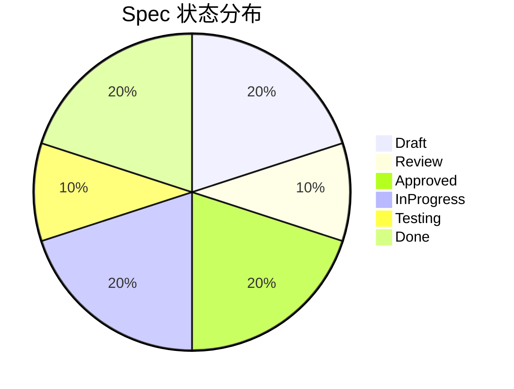
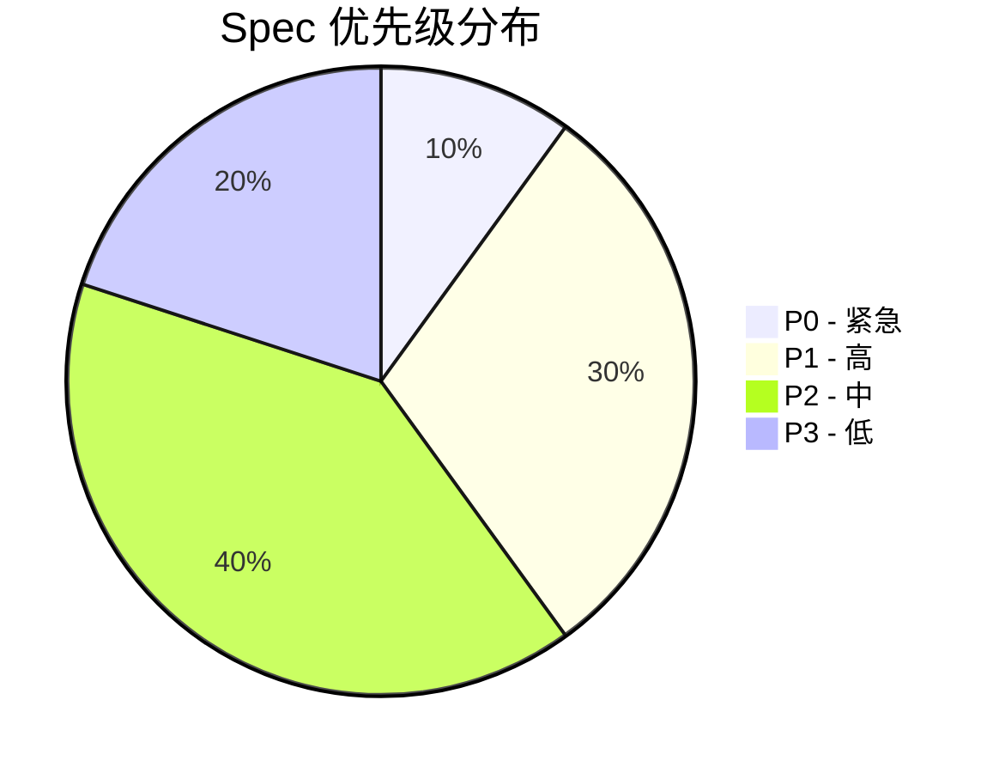

# Spec 状态看板

> 实时查看所有 Spec 的开发状态和进度

---

## 📊 状态概览

```
总计: 10 | 🟨 Draft: 2 | 🟦 Review: 1 | 🟩 Approved: 2 | 🟪 InProgress: 2 | 🟧 Testing: 1 | ✅ Done: 2
```

---

## 📋 按照 Tag 列表

<details>
<summary>🏷️ <strong>按优先级查看</strong></summary>

### 🔴 P0 - 紧急 (1)

| Spec ID | 名称 | 负责人 | 状态 | 更新时间 |
|---------|------|--------|------|----------|
| FEAT-001 | 修复生产环境登录 Bug | @alice | 🟪 InProgress | 2024-01-15 |

### 🟠 P1 - 高 (3)

| Spec ID | 名称 | 负责人 | 状态 | 更新时间 |
|---------|------|--------|------|----------|
| FEAT-002 | 用户认证功能 | @bob | 🟧 Testing | 2024-01-14 |
| FEAT-003 | 订单管理模块 | @charlie | 🟩 Approved | 2024-01-13 |
| FEAT-004 | 权限控制优化 | @david | 🟨 Draft | 2024-01-12 |

### 🟡 P2 - 中 (4)

| Spec ID | 名称 | 负责人 | 状态 | 更新时间 |
|---------|------|--------|------|----------|
| FEAT-005 | 数据导出功能 | @eve | ✅ Done | 2024-01-11 |
| FEAT-006 | 报表统计 | @frank | 🟨 Draft | 2024-01-10 |
| FEAT-007 | 消息通知 | @grace | 🟪 InProgress | 2024-01-09 |
| FEAT-008 | 文件上传 | @henry | ✅ Done | 2024-01-08 |

### 🟢 P3 - 低 (2)

| Spec ID | 名称 | 负责人 | 状态 | 更新时间 |
|---------|------|--------|------|----------|
| FEAT-009 | 主题切换 | @iris | 🟦 Review | 2024-01-07 |
| FEAT-010 | 快捷键配置 | @jack | 🟩 Approved | 2024-01-06 |

</details>

---

## 🔄 按照 Workflow 列表

<details>
<summary>🟨 <strong>Draft - 草稿 (2)</strong></summary>

| Spec ID | 名称 | 类型 | 负责人 | 优先级 | 创建时间 |
|---------|------|------|--------|--------|----------|
| FEAT-004 | 权限控制优化 | feature | @david | 🟠 P1 | 2024-01-12 |
| FEAT-006 | 报表统计 | feature | @frank | 🟡 P2 | 2024-01-10 |

</details>

<details>
<summary>🟦 <strong>Review - 评审中 (1)</strong></summary>

| Spec ID | 名称 | 类型 | 负责人 | 优先级 | 提交时间 |
|---------|------|------|--------|--------|----------|
| FEAT-009 | 主题切换 | component | @iris | 🟢 P3 | 2024-01-07 |

</details>

<details>
<summary>🟩 <strong>Approved - 已批准 (2)</strong></summary>

| Spec ID | 名称 | 类型 | 负责人 | 优先级 | 批准时间 |
|---------|------|------|--------|--------|----------|
| FEAT-003 | 订单管理模块 | feature | @charlie | 🟠 P1 | 2024-01-13 |
| FEAT-010 | 快捷键配置 | skill | @jack | 🟢 P3 | 2024-01-06 |

</details>

<details>
<summary>🟪 <strong>InProgress - 开发中 (2)</strong></summary>

| Spec ID | 名称 | 类型 | 负责人 | 优先级 | 开始时间 |
|---------|------|------|--------|--------|----------|
| FEAT-001 | 修复生产环境登录 Bug | feature | @alice | 🔴 P0 | 2024-01-15 |
| FEAT-007 | 消息通知 | feature | @eve | 🟡 P2 | 2024-01-09 |

</details>

<details>
<summary>🟧 <strong>Testing - 测试中 (1)</strong></summary>

| Spec ID | 名称 | 类型 | 负责人 | 优先级 | 测试开始时间 |
|---------|------|------|--------|--------|--------------|
| FEAT-002 | 用户认证功能 | feature | @bob | 🟠 P1 | 2024-01-14 |

</details>

<details>
<summary>✅ <strong>Done - 已完成 (2)</strong></summary>

| Spec ID | 名称 | 类型 | 负责人 | 完成时间 |
|---------|------|------|--------|----------|
| FEAT-005 | 数据导出功能 | feature | @eve | 2024-01-11 |
| FEAT-008 | 文件上传 | api | @henry | 2024-01-08 |

</details>

---

## 📈 统计图表

### 按状态分布



### 按优先级分布



---

## 🏆 最近完成

| Spec ID | 名称 | 完成时间 | 耗时 |
|---------|------|----------|------|
| FEAT-005 | 数据导出功能 | 2024-01-11 | 7 天 |
| FEAT-008 | 文件上传 | 2024-01-08 | 5 天 |

---

## ⚠️ 需要关注

| Spec ID | 名称 | 状态 | 问题 |
|---------|------|------|------|
| FEAT-001 | 修复生产环境登录 Bug | 🟪 InProgress | 已超期 2 天 |
| FEAT-002 | 用户认证功能 | 🟧 Testing | 测试阻塞，等待依赖 |

---

## 📅 里程碑

| 里程碑 | 目标日期 | 进度 |
|--------|----------|------|
| Q1 发布 | 2024-03-31 | 60% |
| Q2 发布 | 2024-06-30 | 20% |
| Q3 发布 | 2024-09-30 | 5% |
| Q4 发布 | 2024-12-31 | 0% |

---

## 🔍 搜索和过滤

### 快速筛选

```bash
# 查看所有 P0 Spec
/project:spec-filter --priority P0

# 查看指定负责人
/project:spec-filter --owner @alice

# 查看指定状态
/project:spec-filter --status InProgress
```

---

## 📊 趋势分析

### 近 7 天活动

| 日期 | 创建 | 完成 | 其他 |
|------|------|------|------|
| 2024-01-15 | 0 | 0 | 1 |
| 2024-01-14 | 0 | 0 | 1 |
| 2024-01-13 | 0 | 0 | 1 |
| 2024-01-12 | 1 | 0 | 0 |
| 2024-01-11 | 0 | 1 | 0 |
| 2024-01-10 | 1 | 0 | 0 |
| 2024-01-09 | 0 | 0 | 1 |

---

## 📞 团队联系

| 角色 | 姓名 | 联系方式 |
|------|------|----------|
| 产品经理 | PM | pm@example.com |
| 技术负责人 | TL | tl@example.com |
| 开发主管 | DEV | dev@example.com |
| 测试主管 | QA | qa@example.com |

---

## 🔗 相关链接

- [完整流程文档](./SPEC_WORKFLOW.md)
- [快速参考卡片](./QUICK_REFERENCE.md)
- [Spec 模板目录](./templates/)

---

## 📝 更新日志

| 时间 | 更新内容 |
|------|----------|
| 2024-01-15 10:00 | FEAT-001 状态更新为 InProgress |
| 2024-01-14 15:00 | FEAT-002 进入测试阶段 |
| 2024-01-13 09:00 | FEAT-003 评审通过，状态 Approved |
| 2024-01-11 17:00 | FEAT-005 完成，状态 Done |

---

**自动更新时间**: 2024-01-15 10:30
**数据刷新频率**: 每 5 分钟

---

## 💡 使用提示

- 点击各章节展开查看详细信息
- 使用搜索功能快速定位 Spec
- 关注"需要关注"部分的超期项目
- 定期查看"最近完成"了解团队进展
